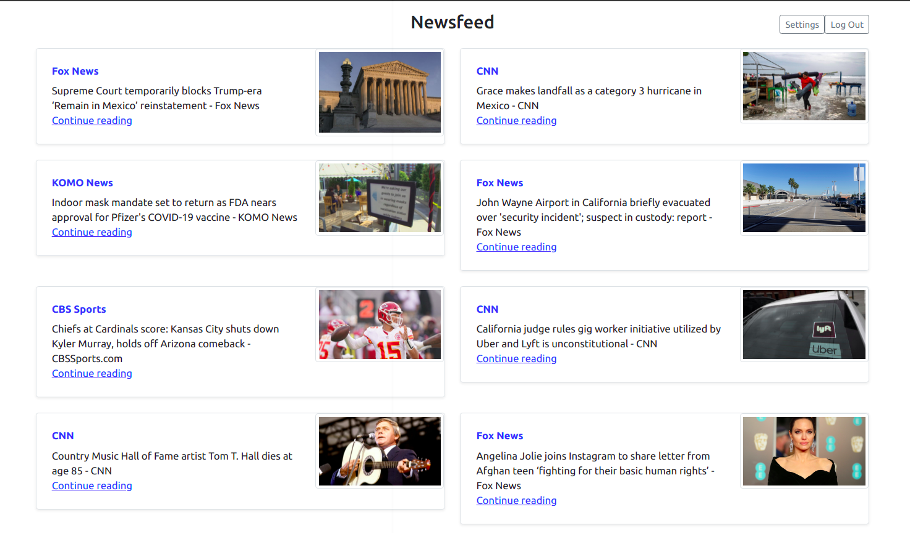
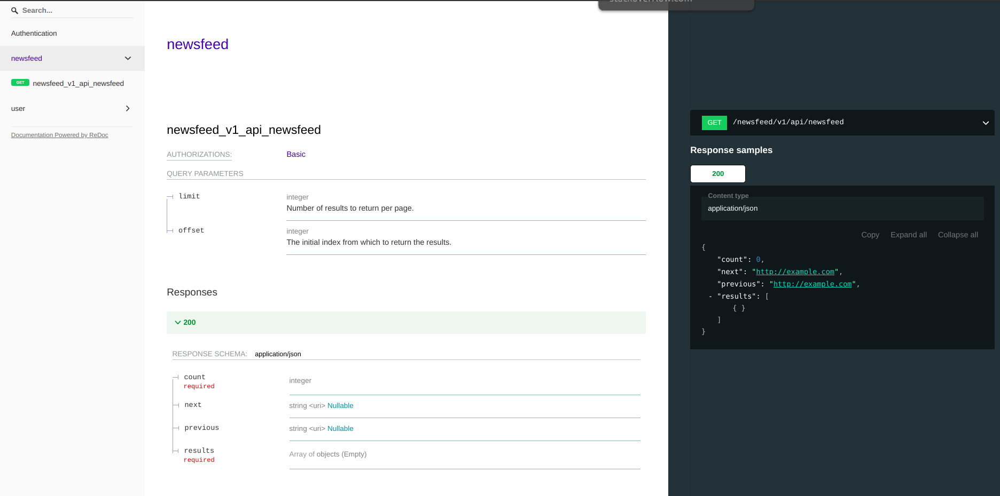
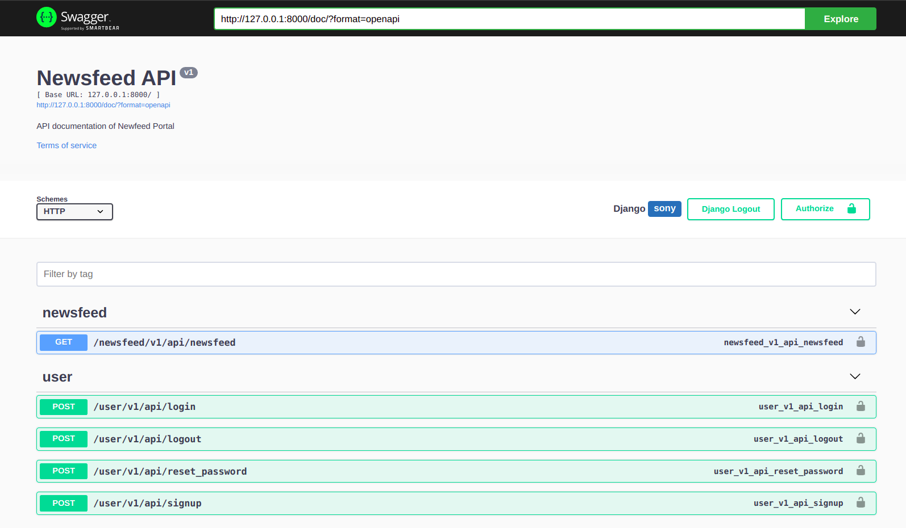

# Newsfeed Portal

The objective of this project is to create a personalized Newsfeed portal.




## Installation Notes

Create a Virtual Environment. Simply run

```
poetry shell
```

If you haven't installed Poetry into your Local machine or Server. Please Install Poetry. For Installing Documentations [Click Here](https://python-poetry.org/docs/#installation)

Install the the Package Requirements from ``poetry.lock``.

```
poetry install
```

Set up ``.env`` file in the folder directory ``conf/settings/.env``. Sample ``.env`` file is in the ``.env.example`` file. Add the necessary environment variable values

Run the database migration

```
python manage.py migrate
```

To execute locally, simply run the ``manage.py`` file

```
python manage.py runserver
```

### To run using Docker

```
docker-compose build
```

```
docker-compose up -d
```

## API Documentation

Check the API's in Swagger and Redoc

**Redoc**



```
http://127.0.0.1:8000/redoc/
```

**Swagger Doc**



```
http://127.0.0.1:8000/doc/
```

## Built With

* [Python](https://www.python.org/) - Language Used
* [Django](https://www.djangoproject.com/) - Framework Used
* [Django Rest Framework](https://www.djangoproject.com/) - Restfull Library Used
* [NewsAPI](https://newsapi.org/) - API's used for fetching news
* [Sendgrid](https://sendgrid.com/) - Used for sending emails
* [Psycopg](https://www.psycopg.org/docs/) - PostgreSQL Database Adapter for Python

## GIT branching Strategies
**Gitflow** is used as a Git workflow here that will help with continuous software development and implementation of DevOps practices.


## Folder Structure

```
NewsfeedPortal/         # Root Folder
|- apps/                # Main application folder that consists of all the project apps
    |- newsfeed/        # Project app
        |- static/      # App specific static file folder
        |- templates/   # App specific templates file folder
            |- newsfeed/
        |- tests/       # App specific test suit folder
        |- utils/       # App specific utility file folder
        |- views/       # Folder contains all the views for the app
        |- admin.py
        |- apps.py
        |- models.py
        |- urls.py
|- conf/                # Base folder for all the configuarations
    |- settings
        |- .env
        |- .env.example
        |- base.py      # Base settings file
        |- development.py # Settings file for developments environment
        |- production.py # Settings file for production environment
    asgi.py
    urls.py
    wsgi.py
|- core/                # Base app
    |- constants
        |- constants.py
        |- defaults.py
    admin.py
    apps.py
    tests.py
    utils.py
    models.py
    mixins.py
    ...
|- log                  # Folder for all the logs
|- static
|- templates
|- .gitignore           # gitignore
|- Dockerfile
|- docker-compose.yml
|- manage.py            # Django's command-line utility
|- requirements.txt     # Required package file
|- README.md
```
